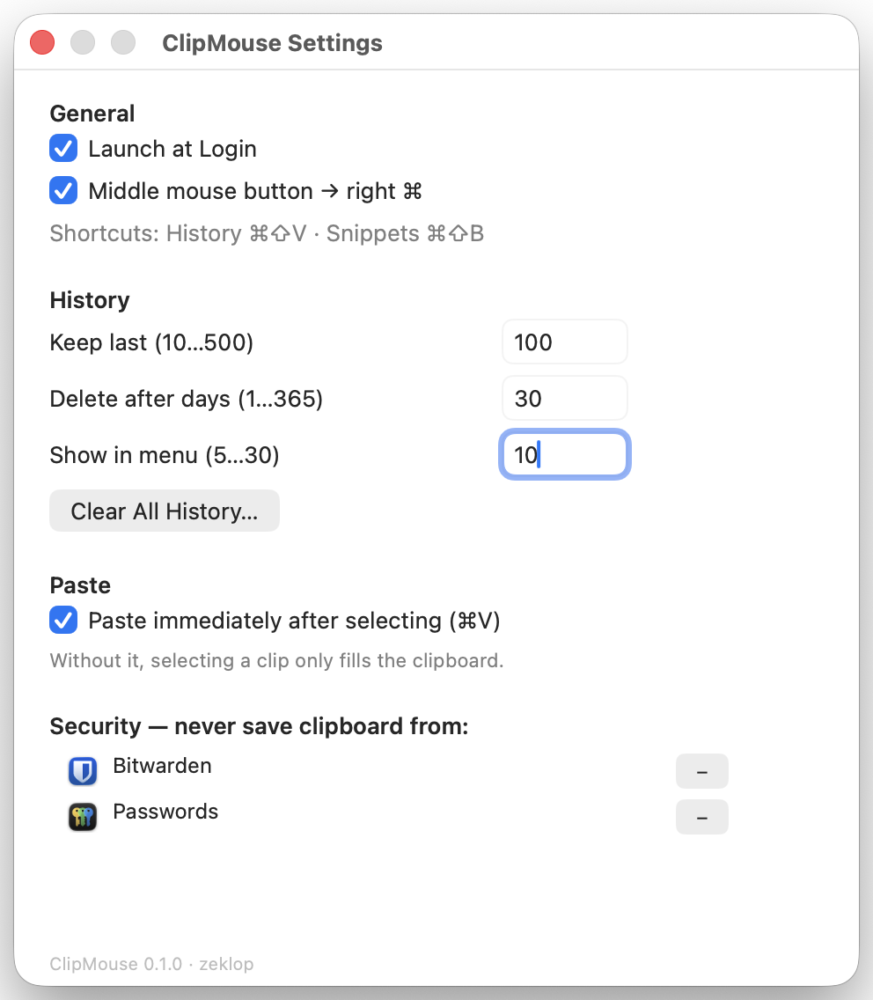

<p align="center">
  
</p>

<h1 align="center">ClipMouse</h1>

<p align="center"><strong>Native macOS clipboard manager — history, snippets and keep-awake in one menu bar icon</strong></p>

<p align="center">
  <a href="README.ru.md">Читать по-русски</a> ·
  <a href="https://zeklop.github.io/clipmouse/">Landing page</a>
</p>

<p align="center">
  
  
  
  
  
  
  
</p>

ClipMouse is a native macOS 26 menu bar agent. It replaces **ClipMenu 0.4.3**, a **Karabiner-Elements** rule and **KeepingYouAwake**: deduplicated clipboard history, Spotlight-style search, snippets with placeholders, secret protection and caffeine timers. No network, no telemetry, no dependencies.

## Why ClipMouse

Everything three utilities used to do — in one native app:

| Before | With ClipMouse |
| --- | --- |
| ClipMenu 0.4.3 — x86_64 binary built in 2008–2009, running on Rosetta 2 | Native arm64 app written in Swift 6 |
| A Karabiner-Elements rule (middle button → right ⌘ for voice input) | Built-in remap — no extra config files |
| KeepingYouAwake | Awake timers live in the icon's right-click menu |

The original pain: the old ClipMenu stored its clipboard history (`clips.data`) **in plain text**, including passwords and API tokens. ClipMouse was built so secrets never hit the disk in the first place.

## Features

- **Clipboard history** — text, links, images, PDFs and files: up to 200 entries (configurable to 500). Duplicates collapse, storage is 30 days.
- **Spotlight-style search** — a panel that filters by content and by source app: query “Telegram” finds everything you copied from Telegram. Right-click a clip to delete it or block the source app.
- **Smart paste** — <kbd>⌥</kbd> pastes as plain text, <kbd>⌘</kbd> as a POSIX path. Synthetic-⌘V auto-paste is optional and off by default; it waits for the target app and for modifier keys to be released, and detects Secure Input.
- **Snippets** — categories and CRUD management right in the menu. Placeholders `{date:HH:mm}`, `{clipboard}` and `{uuid}` expand on paste.
- **Secret protection** — tokens (`sk-`, `ghp_`, PEM), card numbers and high-entropy strings are never saved; Bitwarden, Passwords and Terminal are blocked out of the box. Hold <kbd>⌥</kbd> to save anyway.
- **Keep-awake** — right-click the icon and your Mac stays up for an hour: timers from 5 minutes to indefinite, a battery threshold, remaining time glows in the orange rings. Scriptable via the `clipmouse://caffeine/activate?seconds=N` URL scheme.
- **Middle button → right ⌘** — the middle mouse button becomes right Command, for voice input in Spokenly. CGEventTap with a stuck-key watchdog and a dictation suppression window; the mapping lives here, not in Karabiner.
- **Native and light** — pure AppKit on Swift 6, zero third-party dependencies, SQLite in WAL mode, launch-at-login, self-signed so Accessibility permission survives rebuilds. Around 0% CPU when idle.

## Shortcuts

| Action | Shortcut |
| --- | --- |
| Clipboard history menu | <kbd>⌘⇧V</kbd> |
| Snippets menu | <kbd>⌘⇧B</kbd> |
| Keep-awake (caffeine) | right-click the menu bar icon |
| Paste from search panel | <kbd>Return</kbd> · plain text <kbd>⌥</kbd> · POSIX path <kbd>⌘</kbd> · close <kbd>Esc</kbd> |
| Edit a snippet | <kbd>⌥</kbd> · Delete a snippet <kbd>⌥⇧</kbd> |

The menu: history → Awake ▸ → Snippets ▸ → Search… → Settings → Quit.

## Privacy — your history never leaves your Mac

ClipMouse never touches the network — **at all**. No telemetry, no analytics, no phone-home updates: there is nothing to count, so there are no counters.

| | |
| --- | --- |
| **1.3 MB** | on disk |
| **~20 MB** | in memory |
| **0.0%** | CPU when idle |
| **0** | third-party dependencies |

Measured on a live process, not promised on someone's word.

- **Database at 0600** — SQLite lives in `~/Library/Application Support`: file 0600, directory 0700, excluded from backups.
- **Concealed types ignored** — `Concealed`, `Transient` and `AutoGenerated` pasteboard types are skipped; password managers mark their copies themselves.
- **App blocklist** — Bitwarden, Passwords and Terminal are blocked by default; manageable from the UI, per clip: “Never save from” that app.
- **Backup before purge** — Clear History writes a backup dump first; an accidental purge loses nothing.

## Install — build from source

There are no prebuilt binaries yet: ClipMouse builds with one command from the repository.

```sh
git clone https://github.com/zeklop/clipmouse.git
cd clipmouse
make install   # build → bundle → sign → /Applications
make check     # debug + release + selftest; warnings fail the build
```

1. **Clone the repository.** You will need the Command Line Tools for Swift 6 — Xcode is not required.
2. **`make install`** builds a release binary, generates the icns, signs it (a personal certificate is auto-detected) and copies it to `/Applications`.
3. **Permissions on first launch** — allow clipboard access and grant Accessibility; the app walks you to the right screens.
4. **Optional: keep Accessibility across rebuilds.** With the default adhoc signature every rebuild resets the Accessibility permission. Create a personal certificate once: `bash scripts/make-cert.sh`, then follow [docs/codesign-and-tcc.md](docs/codesign-and-tcc.md) — rebuilds stop resetting permissions.

Diagnostic flags of the binary: `--selftest`, `--paste-test` (posts a synthetic ⌘V to the frontmost app), `--spike-right-cmd`.

## Screenshots

The real interface of the app — no design fiction.

| Search panel | History menu |
| --- | --- |
|  |  |

| Settings |
| --- |
|  |

## Project layout

```
Sources/ClipMouseCore/     all logic (a library — also used by --selftest)
  Core/        Prefs, Log, Permissions (TCC), SelfTest
  Clipboard/   Clip + ClipboardIO, ClipStore (actor, SQLite), ClipboardMonitor,
               SourceTracker, Paster, SecretHeuristics
  Menu/        StatusItemController, StatusIcon, MenuBuilder
  Search/      SearchPanel, SearchView
  Hotkeys/     HotKeyCenter (Carbon, ⌃⌥ ↔ ⌘⇧ modes)
  Mouse/       MouseRemapper (tap, watchdog, dictation suppression)
  Awake/       AwakeController, PowerSource
  Settings/    SettingsWindow
  Snippets/    SnippetStore, Placeholders
Sources/ClipMouse/main.swift   guard, AppDelegate, diagnostics
scripts/        make-cert.sh, make-icon.swift, phase1-check.sh, spike-right-cmd.swift
docs/           landing page (GitHub Pages)
design/icons/   icon concept (SVG is the source of truth)
```

Settings live under `dev.zeklop.clipmouse`: the UI covers the common cases; rare keys (`history.pollInterval`, `menu.titleLength`, `hotkey.*`, `security.dictationSuppressSeconds`, …) are reachable via `defaults write`.

## Requirements

- macOS 26 or later
- Apple Silicon (arm64)
- Command Line Tools for Swift 6 (no Xcode needed)

## FAQ

**What is ClipMouse?**
A native menu bar clipboard manager for macOS 26 that combines clipboard history, snippets, secret protection, keep-awake timers and a middle-button remap — replacing three separate utilities with one icon.

**Is it a replacement for ClipMenu?**
Yes — a successor to ClipMenu 0.4.3, an x86_64 binary from 2008–2009 living on Rosetta 2. The ⌘⇧V / ⌘⇧B hotkeys carry over; old history is not migrated (it is a rolling buffer and refills in days; import is on the backlog). ClipMenu's JavaScript actions are intentionally not carried over.

**Does it replace KeepingYouAwake?**
Right-click the ClipMouse icon: timers from 5 minutes to indefinite, a battery threshold, and the countdown glows in the icon's orange rings. There is also a `clipmouse://caffeine/activate?seconds=N` URL scheme for scripts.

**Does ClipMouse phone home?**
Never. No network access at all — no telemetry, no analytics, no update checks.

**Where is my clipboard history stored?**
In a local SQLite database in `~/Library/Application Support`: file permissions 0600, directory 0700, excluded from backups. Secrets (tokens, PEM keys, card numbers, high-entropy strings) are not saved at all.

**Are there prebuilt downloads or Homebrew?**
Not yet — build from source with `make install`. Downloads are planned once the repo is public.

**Which languages does the UI support?**
English only for now; localization is not on the v1 roadmap.

## Status

Phases 0–6 implemented (2026-08-16); observation week in progress.

ClipMouse 0.1.0 — successor to ClipMenu 0.4.3 · Swift 6 · AppKit · 2026
