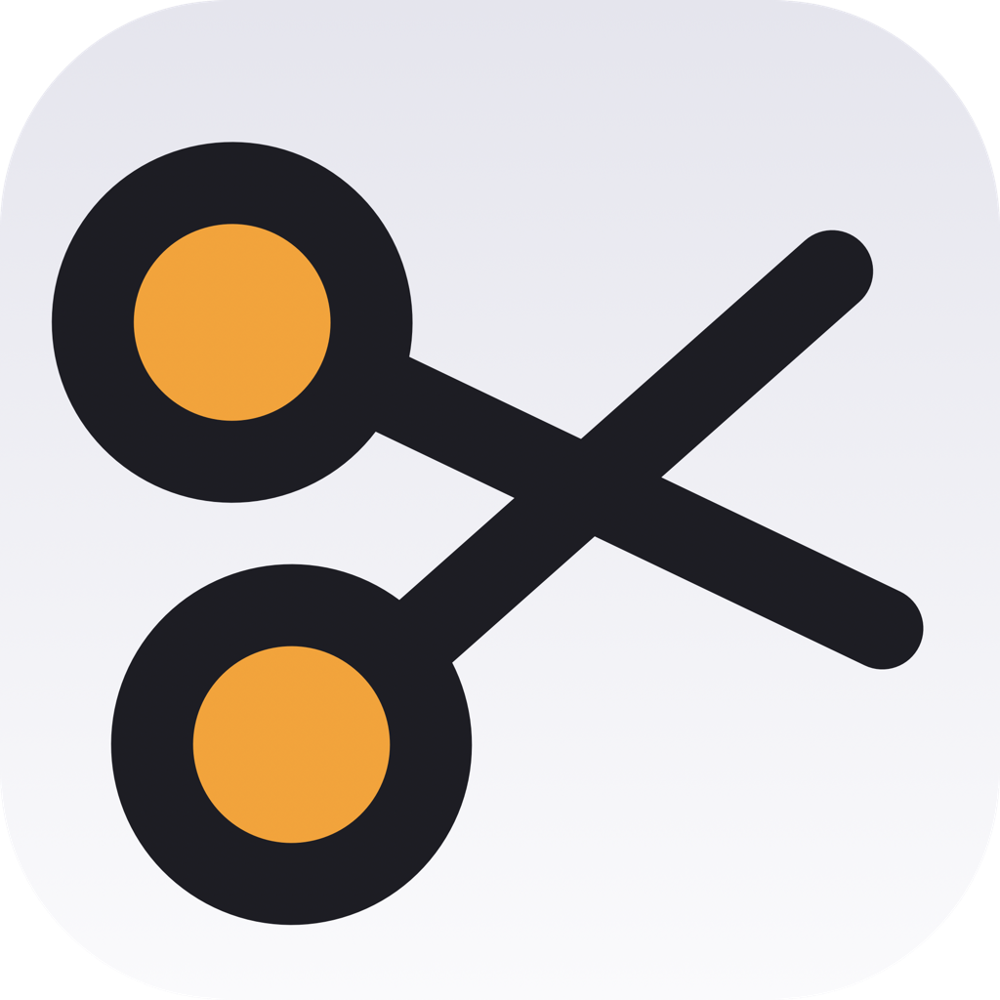
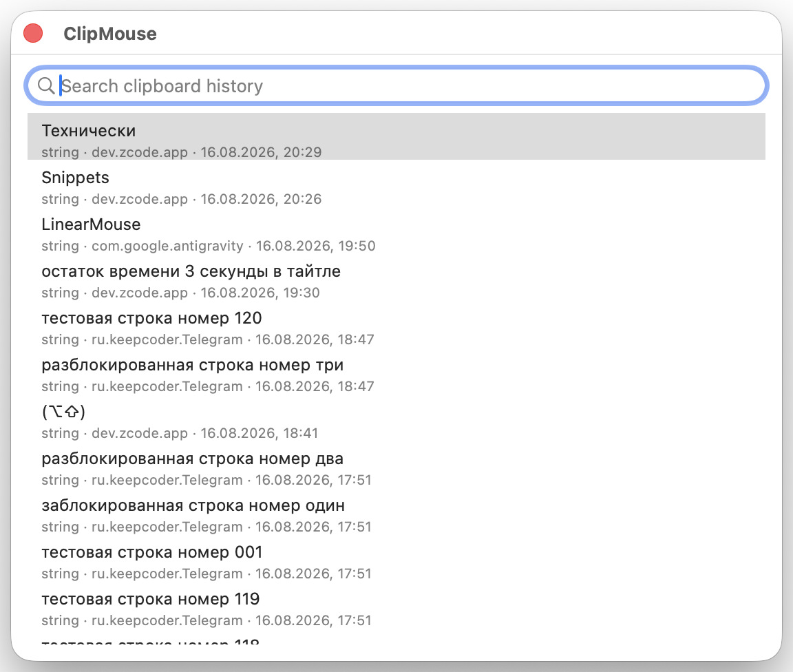
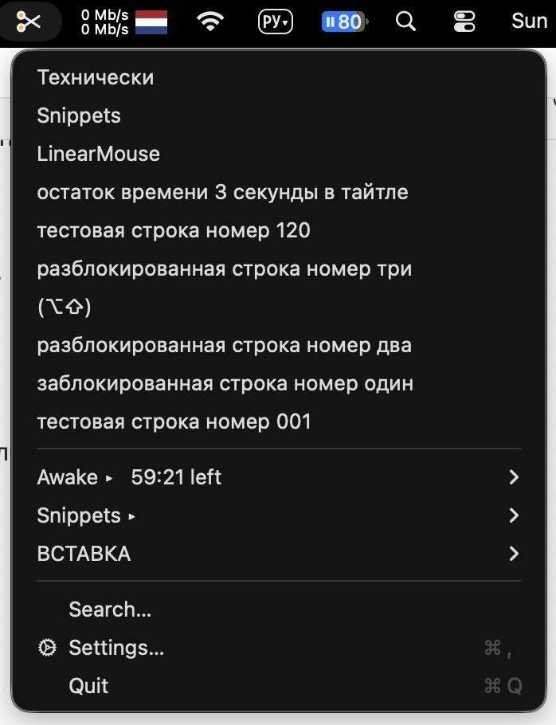
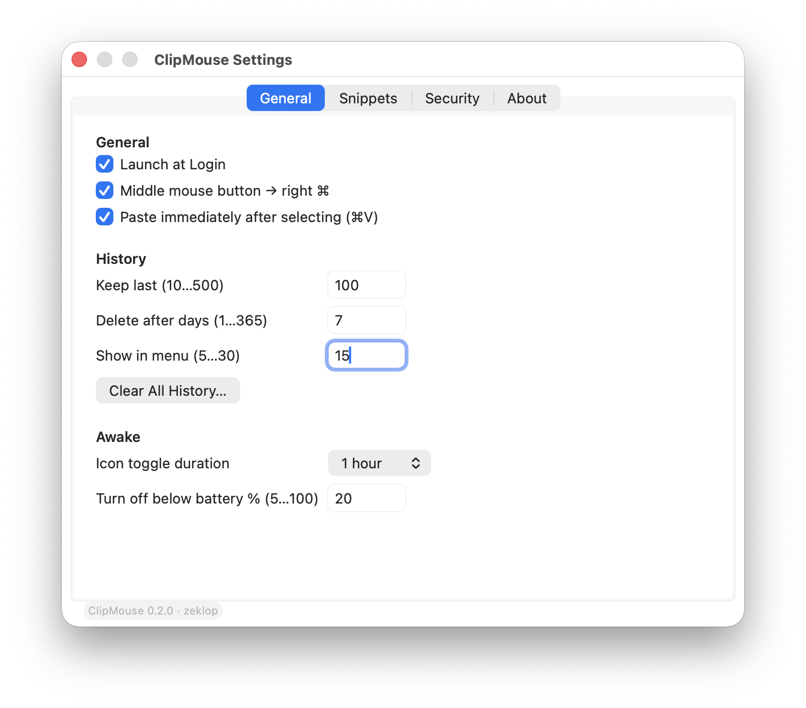
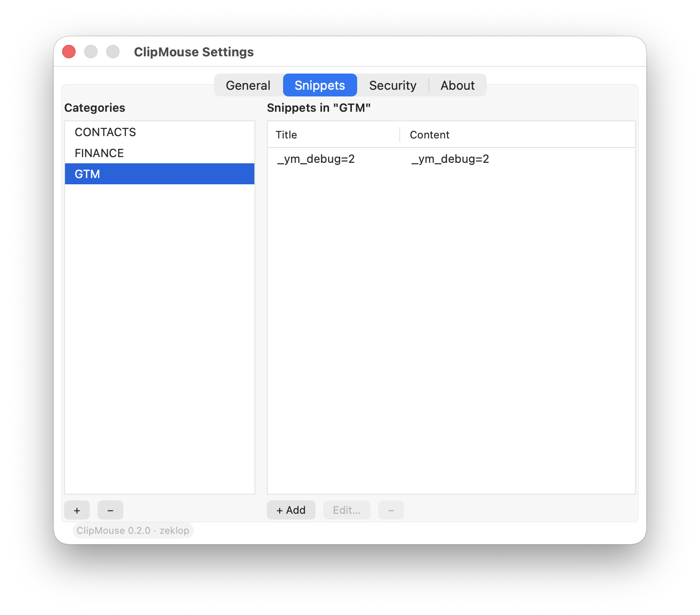
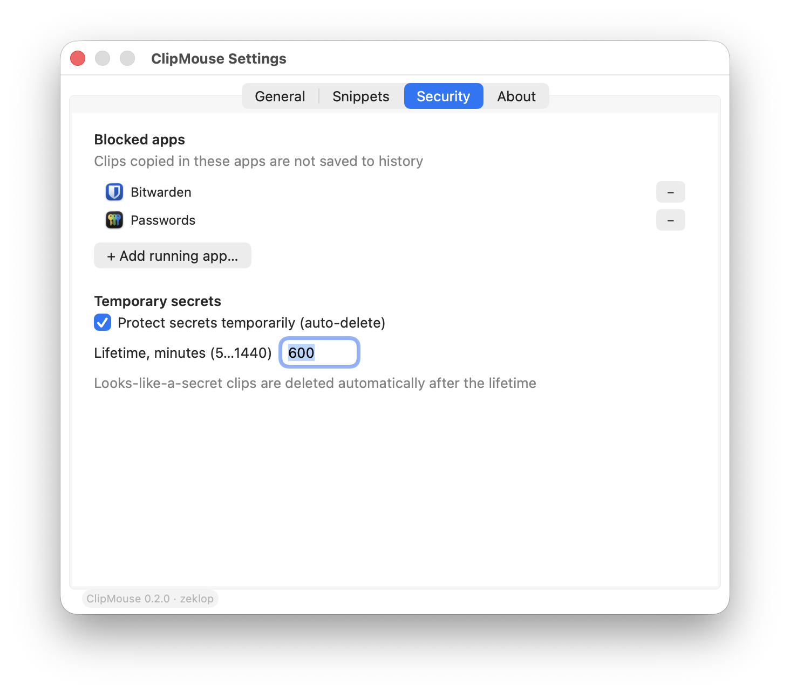
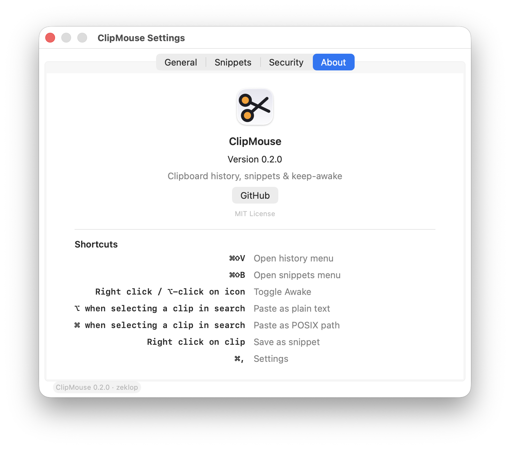

<p align="center">
  
</p>

<h1 align="center">ClipMouse</h1>

<p align="center"><strong>Нативный менеджер буфера обмена для macOS — история, сниппеты и «не засыпать» в одной иконке</strong></p>

<p align="center">
  <a href="README.md">Read in English</a> ·
  <a href="https://zeklop.github.io/clipmouse/">Лендинг</a>
</p>

<p align="center">
  
  
  
  
  
  
  
</p>

ClipMouse — нативный агент для macOS 26 в меню-баре. Заменяет **ClipMenu 0.4.3**, правило **ремаппера кнопок мыши** и **keep-awake-утилиту**: история с дедупликацией, поиск как в Spotlight, сниппеты с плейсхолдерами, защита секретов и таймеры кофеина. Без сети, телеметрии и зависимостей.

## Зачем ClipMouse

Всё, что раньше делали три утилиты, — в одном нативном приложении:

| Было | Стало с ClipMouse |
| --- | --- |
| ClipMenu 0.4.3 — бинарник x86_64 сборки 2008–2009, живёт на Rosetta 2 | Нативное arm64-приложение на Swift 6 |
| Правило Karabiner-Elements (средняя кнопка → правый ⌘ для голосового ввода) | Встроенный ремап, без лишних конфигов |
| KeepingYouAwake | Таймеры Awake в правом клике по иконке |

Дыра, ради которой всё: старый ClipMenu хранил историю (`clips.data`) **открытым текстом**, включая пароли и API-токены. ClipMouse устроен так, что секреты не задерживаются на диске: распознанный секрет сохраняется как *временный* клип — доступен настраиваемое время (по умолчанию час), затем автоматически удаляется из меню и базы.

### ClipMouse против остальных

Каждый конкурент закрывает ровно одну категорию; ClipMouse — единственный закрывает все четыре, и бесплатно. Все 20 исследованных приложений:

| Приложение | Категория | История буфера | Сниппеты | Keep-awake | Ремап мыши | Защита секретов | Только локально | Open source | Бесплатно |
| --- | --- | :-: | :-: | :-: | :-: | :-: | :-: | :-: | :-: |
| **ClipMouse** | все четыре | ✓ | ✓ | ✓ | ✓ | ✓ (автоматически) | ✓ | ✓ | ✓ |
| Paste | clipboard | ✓ | — | — | — | — | — (iCloud sync) | — | — (подписка) |
| Maccy | clipboard | ✓ | — | — | — | ? | ✓ | ✓ | ✓ |
| CopyClip 2 | clipboard | ✓ | — | — | — | ? | ✓ | — | — ($7.99) |
| Flycut | clipboard | ✓ | — | — | — | ? | ✓ | ✓ | ✓ |
| Copied | clipboard | ✓ | — | — | — | ? | — (iCloud) | — | — (заброшен) |
| Unclutter | clipboard + файлы + заметки | ✓ | — | — | — | ? | ✓ | — | — ($19.99) |
| Pastebot 3 | clipboard | ✓ | — | — | — | ? | ✓ | — | — (подписка) |
| Clipy | clipboard | ✓ | ✓ | — | — | ? | ✓ | ✓ | ✓ |
| TextExpander | snippets | — | ✓ | — | — | — | — (серверы вендора) | — | — (~$50/год) |
| SnippetsLab | snippets | — | ✓ | — | — | ? | — (iCloud) | — | ✓ |
| aText | snippets | — | ✓ | — | — | ? | — (онлайн-активация) | — | — (подписка/lifetime) |
| Espanso | snippets | — | ✓ | — | — | ? | ✓ | ✓ | ✓ |
| Amphetamine | keep-awake | — | — | ✓ | — | n/a | ✓ | — | ✓ |
| KeepingYouAwake | keep-awake | — | — | ✓ | — | n/a | ✓ | ✓ | ✓ |
| Caffeine | keep-awake | — | — | ? | — | n/a | ✓ | ~ (только форки) | ✓ |
| Lungo | keep-awake | — | — | ✓ | — | n/a | ✓ | — | — (платно) |
| Karabiner-Elements | ремаппер мыши | — | — | — | ✓ | n/a | ✓ | ✓ | ✓ |
| SteerMouse | ремаппер мыши | — | — | — | ✓ | n/a | ✓ | — | — (платные апгрейды) |
| BetterMouse | ремаппер мыши | — | — | — | ✓ | n/a | ✓ | — | — ($7.99) |
| LinearMouse | ремаппер мыши | — | — | — | ✓ | n/a | ✓ | ✓ | ✓ |

`?` = не задокументировано; `~` = не работает на актуальных macOS. Caffeine нестабильна с ~2014 года, Copied заброшен в ~2020-м, у Flycut не было релизов с декабря 2020.

## Возможности

- **История буфера** — текст, ссылки, картинки, PDF и файлы: до 200 записей (настраивается до 500). Повторы схлопываются, хранение — 30 дней.
- **Поиск как в Spotlight** — панель с фильтром по содержимому и по приложению-источнику: запрос «Telegram» покажет всё, что вы копировали из Telegram. Правый клик по клипу — сохранить как сниппет, удалить или заблокировать приложение-источник.
- **Умная вставка** — <kbd>⌥</kbd> вставляет чистым текстом, <kbd>⌘</kbd> — POSIX-путём. Автовставка через синтетический ⌘V опциональна и по умолчанию выключена: она ждёт активации цели и отпускания модификаторов, Secure Input детектится.
- **Сниппеты** — категории и сниппеты управляются в настройках (отдельная вкладка Snippets с инлайн-редактированием); меню бара остаётся только для вставки. Плейсхолдеры `{date:HH:mm}`, `{clipboard}` и `{uuid}` разворачиваются при вставке.
- **Защита секретов** — токены (`sk-`, `ghp_`, PEM), номера карт и высокоэнтропийные строки хранятся только как временные клипы: помечены иконкой часов, доступны настраиваемое время (по умолчанию час), затем автоматически удаляются из меню и базы. Bitwarden, Passwords и Terminal — в чёрном списке из коробки. Правый клик по клипу сохраняет его как сниппет.
- **Режим «не засыпать»** — правый клик по иконке, и Mac бодр час: таймеры от 5 минут до бесконечности, порог батареи, остаток виден в оранжевых кольцах. Скрипты — через URL-схему `clipmouse://caffeine/activate?seconds=N`.
- **Средняя кнопка → правый ⌘** — средняя кнопка мыши становится правой Command для голосового ввода в Spokenly. CGEventTap c watchdog'ом залипания и окном подавления диктовок; карта живёт здесь, а не в Karabiner.
- **Нативный и лёгкий** — чистый AppKit на Swift 6, ноль сторонних зависимостей, SQLite в WAL-режиме, автозапуск, собственный сертификат — права переживают пересборки. В простое — около 0 % CPU.

## Горячие клавиши

| Действие | Сочетание |
| --- | --- |
| Меню истории | <kbd>⌘⇧V</kbd> |
| Меню сниппетов | <kbd>⌘⇧B</kbd> |
| «Не засыпать» (кофеин) | правый клик по иконке |
| Вставка из поиска | <kbd>Return</kbd> · чистый текст <kbd>⌥</kbd> · POSIX-путь <kbd>⌘</kbd> · закрыть <kbd>Esc</kbd> |
| Сохранить клип как сниппет | правый клик по клипу (в меню или в поиске) |
| Настройки | <kbd>⌘,</kbd> |

Меню: история → Awake ▸ → Snippets (вставка + «Manage Snippets…») → Search… → Settings → Quit.

## Приватность — история не покидает ваш Mac

ClipMouse не ходит в сеть — **вообще**. Ни телеметрии, ни аналитики, ни «домашних» обновлений: считать нечего, счётчиков нет.

| | |
| --- | --- |
| **1,3 МБ** | на диске |
| **≈20 МБ** | в памяти |
| **0,0 %** | CPU в простое |
| **0** | сторонних зависимостей |

Замерено на живом процессе, а не обещано на слово.

- **БД с правами 0600** — SQLite лежит в `~/Library/Application Support`: файл 0600, каталог 0700, исключён из бэкапов.
- **Скрытое не читается** — типы пастборда `Concealed`, `Transient` и `AutoGenerated` пропускаются; менеджеры паролей помечают копирование сами.
- **Чёрный список** — Bitwarden, Passwords и Terminal заблокированы по умолчанию, управление — из UI: правый клик по клипу → Never save from этого приложения.
- **Дамп перед очисткой** — Clear History сначала пишет резервный дамп: случайная очистка ничего не теряет.

## Установка

Готовый DMG — в [GitHub Releases](https://github.com/zeklop/clipmouse/releases), либо сборка из исходников одной командой.

```sh
git clone https://github.com/zeklop/clipmouse.git
cd clipmouse
make install   # build → bundle → sign → /Applications
make check     # debug + release + selftest; ворнинги валят сборку
```

1. **Клонируйте репозиторий.** Понадобятся Command Line Tools для Swift 6 — Xcode не нужен.
2. **`make install`** соберёт release-бинарник, сгенерирует icns, подпишет (собственный сертификат детектится сам) и скопирует в `/Applications`.
3. **Разрешения при первом запуске** — два тумблера один раз: [разрешения при первом запуске](docs/permissions.ru.md).
4. **Опционально: AX переживает пересборки.** С подписью adhoc каждая пересборка сбрасывает право Accessibility. Один раз создайте личный сертификат: `bash scripts/make-cert.sh` и следуйте [docs/codesign-and-tcc.md](docs/codesign-and-tcc.md) — пересборки перестанут сбрасывать права.

Диагностические флаги бинарника: `--selftest`, `--paste-test` (постит синтетический ⌘V в активное приложение), `--spike-right-cmd`. Диплинки: `clipmouse://caffeine/activate?seconds=N` и `clipmouse://settings/<tab>`.

## Экраны

Настоящий интерфейс приложения — без графической выдумки.

| Панель поиска | Меню истории |
| --- | --- |
|  |  |

Настройки — одно окно, четыре вкладки:

| **General** — автозапуск, лимиты истории, Awake | **Snippets** — категории и таблица сниппетов |
| --- | --- |
|  |  |
| **Security** — чёрный список и временные секреты | **About** — версия и хоткеи |
|  |  |

## Структура проекта

```
Sources/ClipMouseCore/     вся логика (библиотека — доступна для --selftest)
  Core/        Prefs, Log, Permissions (TCC), SelfTest
  Clipboard/   Clip + ClipboardIO, ClipStore (actor, SQLite), ClipboardMonitor,
               SourceTracker, Paster, SecretHeuristics
  Menu/        StatusItemController, StatusIcon, MenuBuilder
  Search/      SearchPanel, SearchView
  Hotkeys/     HotKeyCenter (Carbon, режимы ⌃⌥ ↔ ⌘⇧)
  Mouse/       MouseRemapper (тап, watchdog, подавление диктовок)
  Awake/       AwakeController, PowerSource
  Settings/    SettingsWindow (с табами), SnippetsTab
  Snippets/    SnippetStore, SnippetSaver, Placeholders
Sources/ClipMouse/main.swift   guard, AppDelegate, диагностика
scripts/        make-cert.sh, make-icon.swift, phase1-check.sh, spike-right-cmd.swift
docs/           лендинг (GitHub Pages)
design/icons/   концепт иконки (SVG — источник истины)
```

Настройки живут в `dev.zeklop.clipmouse`: UI покрывает частое; редкие ключи (`history.pollInterval`, `menu.titleLength`, `hotkey.*`, `security.dictationSuppressSeconds`, …) — через `defaults write`.

## Требования

- macOS 26 и новее
- Apple Silicon (arm64)
- Command Line Tools для Swift 6 (Xcode не нужен)

## FAQ

**Что такое ClipMouse?**
Нативный менеджер буфера обмена для macOS 26 в меню-баре: история, сниппеты, защита секретов, таймеры «не засыпать» и ремап средней кнопки — три утилиты в одной иконке.

**Это замена ClipMenu?**
Да — преемник ClipMenu 0.4.3, Mach-O x86_64 сборки 2008–2009 на Rosetta 2. Хоткеи ⌘⇧V / ⌘⇧B переносятся; старая история не мигрирует (это скользящий буфер, наберётся заново за пару дней; импорт — в бэклоге). JS-акции ClipMenu сознательно не переносятся.

**Заменяет ли KeepingYouAwake?**
Правый клик по иконке: таймеры от 5 минут до бесконечности, порог батареи, остаток времени — в оранжевых кольцах. Для скриптов есть URL-схема `clipmouse://caffeine/activate?seconds=N`.

**ClipMouse ходит в сеть?**
Никогда. Ни телеметрии, ни аналитики, ни проверки обновлений — сети нет вообще.

**Где хранится история?**
В локальной SQLite-базе в `~/Library/Application Support`: файл 0600, каталог 0700, исключён из бэкапов. Секреты (токены, PEM-ключи, номера карт, высокоэнтропийные строки) хранятся только как временные клипы и автоматически удаляются после настраиваемого срока (по умолчанию час).

**Есть готовые сборки или Homebrew?**
Да — DMG приложен к каждому [GitHub Release](https://github.com/zeklop/clipmouse/releases). Формула Homebrew-каски лежит в репозитории (`packaging/Casks/clipmouse.rb`), tap в пути. Сборка из исходников через `make install` работает всегда.

**Какие языки интерфейса?**
Английский и русский — интерфейс следует языку системы (Системные настройки → Основные → Язык и регион).

## Статус

Фазы 0–6 реализованы; версия 0.2.0 принесла окно настроек с табами, инлайн-редактирование сниппетов и защиту временных секретов.

ClipMouse 0.2.0 — преемник ClipMenu 0.4.3 · Swift 6 · AppKit · 2026
