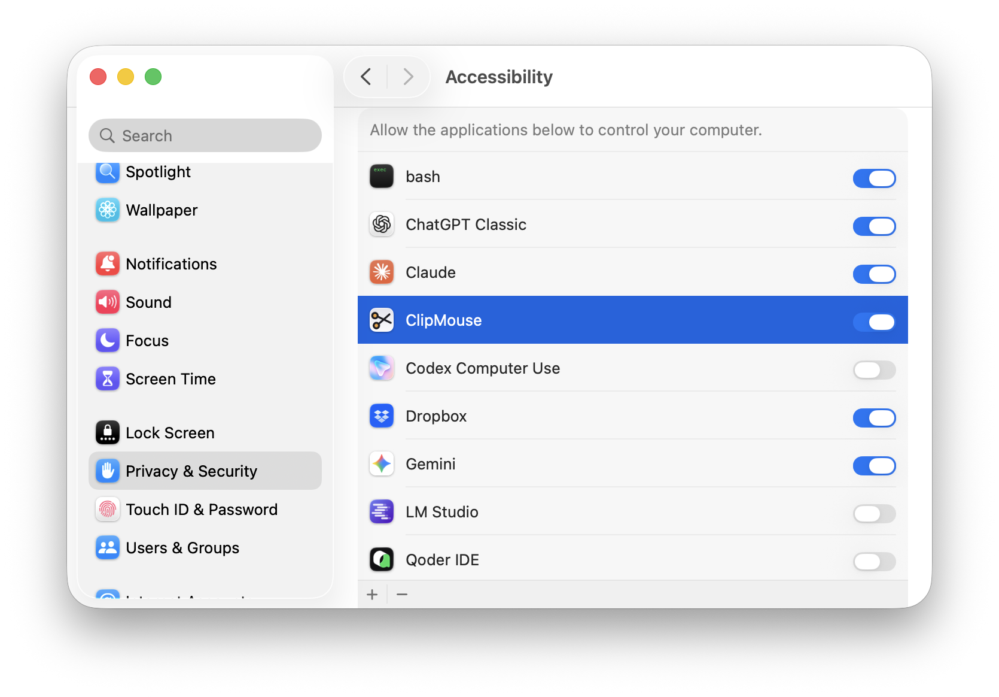

# Разрешения при первом запуске

ClipMouse нужны два однократных разрешения — оба обычные тумблеры macOS, и всё остаётся на вашем Mac.

## 1. Всё равно открыть

*Шаг не нужен, если ставили через Homebrew или собрали из исходников.*

macOS проверяет приложения, скачанные из интернета, и незнакомое блокирует при первом запуске. Это ожидаемо и происходит один раз:

1. Дважды кликните ClipMouse в **Программах** — появится alert.
2. Откройте **Настройки системы → Конфиденциальность и безопасность**.
3. Промотайте вниз и нажмите **«Открыть всё равно»**, подтвердите паролем.

## 2. Доступ к буферу обмена

Нужен, чтобы собирать историю — без него в меню просто нечего показывать. macOS спросит один раз; приветственное окно приложения само откроет нужный экран:

**Настройки системы → Конфиденциальность и безопасность → Буфер обмена** → ClipMouse → **«Всегда разрешать»**.

## 3. Универсальный доступ (Accessibility)

Один тумблер включает всё, что ClipMouse делает с клавиатурой и мышью: хоткей истории ⌘⇧V, сниппеты ⌘⇧B, вставку из панели поиска и ремап средней кнопки на правый ⌘.

**Настройки системы → Конфиденциальность и безопасность → Универсальный доступ** → включите тумблер ClipMouse.



Скриншот выше — из английской системы: нужный раздел там называется **Accessibility**, список подписан «Allow the applications below to control your computer». Если ClipMouse нет в списке, нажмите **+**, подтвердите и выберите ClipMouse в Программах. Перезапуск не нужен — приложение заметит разрешение за пару секунд.

## Если что-то не работает

- **Тумблер включён, а хоткеи не реагируют.** Запись разрешения зависла — известная особенность macOS. Выполните в Терминале и выдайте право заново:
  ```sh
  tccutil reset Accessibility dev.zeklop.clipmouse
  ```
- **Вставка пишет «нажмите ⌘V вручную».** Открыт менеджер паролей с «безопасным вводом» — macOS блокирует синтетические нажатия, пока он работает. Это защита, а не баг.
